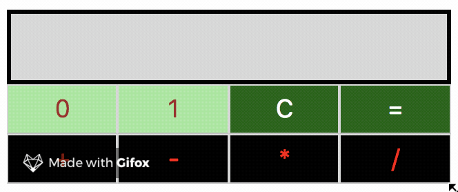

# Javascript Binary Calculator

My solution to:  
https://www.hackerrank.com/challenges/js10-binary-calculator/

<a href="https://jstudenski.github.io/binary-calculator/" target="_blank">Try it!</a>
